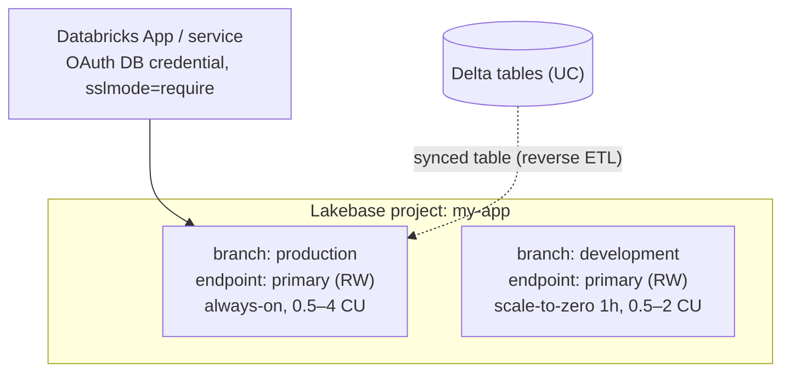

# design-architecture — design first, then (optionally) build

When the user asks for a design/architecture (not "go do it"), YOU author the
design directly (prose + diagrams — no sub-agent needed), then offer to execute
it via the execute+validate flow. Ground every choice in the
`lakebase-autoscaling` skill.

## Deliverable shape

Produce these sections, scaled to the ask:

### 1. Topology (Mermaid)
Show the project → branch → endpoint layout, the app/consumer connection, and any
reverse-ETL flow. Example:



For branch strategy over time, an ERD or git-style branch graph can help:
```mermaid
gitGraph
  commit id: "production"
  branch development
  commit id: "schema change"
  checkout production
```

### 2. ADR (decision record)
- **Context** — what's being solved, constraints (latency, concurrency, cost, region).
- **Decision** — the chosen topology, CU min/max per endpoint, scale-to-zero posture.
- **Options considered** — 2–3 alternatives with trade-offs.
- **Consequences** — operational/cost implications, what to monitor.

### 3. Capacity & cost reasoning
- Pick CU min/max from working set + concurrency (≈2 GB RAM/CU; conn limit scales
  with max CU; range 0.5–32, `max-min ≤ 16`).
- **Scale-to-zero posture:** remember a PRODUCTION RW endpoint can't scale to
  zero (min CU 24/7). For dev/test branches, enable suspend via
  `suspend_timeout_duration`; weigh cold-start latency vs idle cost.
- Branch strategy: production protected; ephemeral dev/test/CI branches with TTL.

### 4. Risks & safety
Call out anything that needs the user's explicit go-ahead (any create/delete of
Lakebase or UC objects) and where exact names/placement are still unknown — never
invent them.

## Then offer to execute
End with: "Want me to build this?" If yes, switch to the `validate` skill:
claude_code executes each step in a worktree, codex validates against this design
as the acceptance contract. Diagrams are authoritative — execution must match them.
